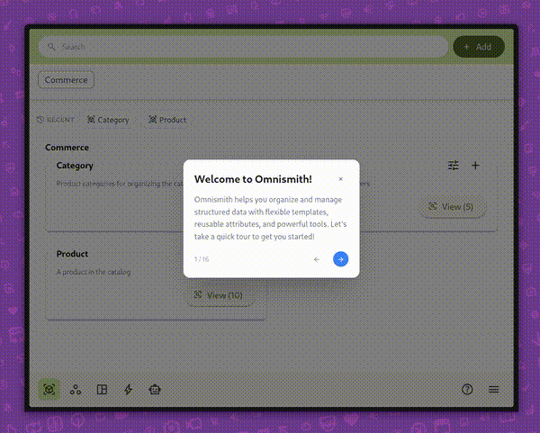

# ng-beacon

Lightweight guided-tour library for Angular 19+ with Angular Signals and zoneless-compatible rendering.
SVG spotlight overlays, keyboard navigation, and lightweight i18n hooks with zero runtime dependencies beyond Angular.



[](https://github.com/HomelessCoder/ng-beacon/actions/workflows/ci.yml)
[](https://www.npmjs.com/package/ng-beacon)
[](LICENSE)

## Features

- **Signal-based** — reactive state via Angular Signals, fully OnPush / zoneless compatible
- **SVG spotlight** — smooth cutout mask highlights the target element
- **Accessible focus handling** — focus moves into the tooltip and is restored on close
- **Keyboard support** — Escape closes, ArrowLeft goes back, ArrowRight advances
- **i18n ready** — plug in any translation function (ngx-translate, Transloco, etc.)
- **Theming** — CSS custom properties for colors, radius, shadow, width
- **Tiny footprint** — no Material, no CDK, no extra runtime deps

## Quick Start

### 1. Install

```bash
npm install ng-beacon
```

### 2. Provide

```ts
// app.config.ts
import { provideBeacon } from 'ng-beacon';

export const appConfig = {
  providers: [
    provideBeacon(),
  ],
};
```

### 3. Add the overlay

```html
<!-- app.component.html -->
@if (beaconService.isActive()) {
  <beacon-overlay />
}
```

```ts
// app.component.ts
import { BeaconOverlay, BeaconService } from 'ng-beacon';

@Component({
  imports: [BeaconOverlay],
  // ...
})
export class AppComponent {
  readonly beaconService = inject(BeaconService);
}
```

### 4. Define steps

```ts
import { BeaconStep } from 'ng-beacon';

export const MY_TOUR: BeaconStep[] = [
  {
    id: 'welcome',
    title: 'Welcome!',
    content: 'Let me show you around.',
    position: 'center',
    showWithoutTarget: true,
  },
  {
    id: 'sidebar',
    title: 'Sidebar',
    content: 'Navigate between sections here.',
    position: 'end',
    selector: '[data-tour="sidebar"]',
  },
];
```

### 5. Start the tour

```ts
this.beaconService.start(MY_TOUR);
```

## Optional Router Integration

If your app uses Angular Router and you want tours to close after route changes, subscribe to `NavigationEnd` in app-level code and call `stop()`:

```ts
import { Component, DestroyRef, inject } from '@angular/core';
import { takeUntilDestroyed } from '@angular/core/rxjs-interop';
import { NavigationEnd, Router } from '@angular/router';
import { filter } from 'rxjs';
import { BeaconService } from 'ng-beacon';

@Component({
  selector: 'app-root',
  template: `<router-outlet />`,
})
export class AppComponent {
  private readonly router = inject(Router);
  private readonly destroyRef = inject(DestroyRef);
  private readonly beaconService = inject(BeaconService);

  constructor() {
    this.router.events
      .pipe(
        filter((event): event is NavigationEnd => event instanceof NavigationEnd),
        takeUntilDestroyed(this.destroyRef),
      )
      .subscribe(() => {
        if (this.beaconService.isActive()) {
          this.beaconService.stop();
        }
      });
  }
}
```

## Component-Scoped Step Registration

Register steps that are only available while a component is alive:

```ts
import { registerTourSteps } from 'ng-beacon';

@Component({ /* ... */ })
export class DashboardComponent {
  private readonly _tour = registerTourSteps(DASHBOARD_STEPS);
}
```

Then start a context-aware tour — steps from destroyed components are automatically pruned:

```ts
this.beaconService.startContextTour();
```

## Translation (i18n)

```ts
import { provideBeacon, provideBeaconTranslateFn } from 'ng-beacon';

providers: [
  provideBeacon({
    labels: { close: 'tour.close', nextStep: 'tour.next', prevStep: 'tour.back' },
  }),
  provideBeaconTranslateFn(() => {
    const translate = inject(TranslateService);
    return (key: string) => translate.instant(key);
  }),
]
```

## Theming

Override CSS custom properties on `beacon-overlay` or any ancestor:

```css
beacon-overlay {
  --beacon-bg: #1e1e2e;
  --beacon-text: #cdd6f4;
  --beacon-primary: #89b4fa;
  --beacon-primary-hover: #74c7ec;
  --beacon-radius: 16px;
  --beacon-shadow: 0 8px 32px rgba(0, 0, 0, 0.4);
  --beacon-width: 360px;
}
```

## API

### `BeaconService`

| Signal / Method | Description |
|---|---|
| `isActive()` | Whether a tour is running |
| `currentStep()` | Current `BeaconStep` or `null` |
| `currentStepIndex()` | Zero-based index or `null` |
| `totalSteps()` | Number of steps (0 when idle) |
| `isFirstStep()` / `isLastStep()` | Position booleans |
| `start(steps)` | Start a tour with explicit steps (snapshot — not reactive to registry changes) |
| `startContextTour()` | Start a tour from all registered context steps (reactive — steps are pruned when components are destroyed) |
| `next()` / `prev()` | Navigate between steps; `next()` stops on the last step and `prev()` stays on the first step |
| `stop()` | End the tour |
| `registerContextSteps(steps)` | Add steps to the registry |
| `unregisterContextSteps(steps)` | Remove steps from the registry |

### `BeaconStep`

```ts
interface BeaconStep {
  id: string;
  title: string;
  content: string;
  position: 'above' | 'below' | 'start' | 'end' | 'center';
  selector?: string;
  showWithoutTarget?: boolean;
}
```

## Keyboard Support

| Key | Action |
|---|---|
| `Escape` | Stop the tour |
| `ArrowLeft` | Go to the previous step |
| `ArrowRight` | Go to the next step |

## Development

```bash
npm install
npm test            # run tests (ChromeHeadless, coverage enforced)
npm run build       # build the library
```

## License

[MIT](LICENSE)
